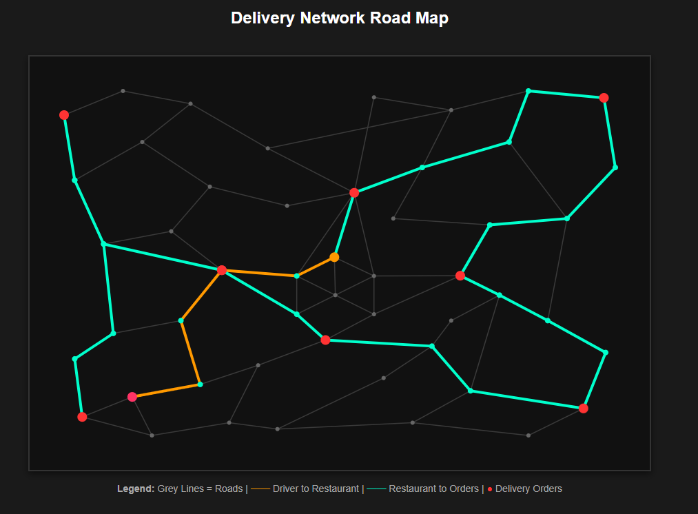

# Graph Path Optimizer

A delivery route optimization system built in C. The project calculates the most efficient route for a delivery driver to pick up an order from a restaurant and deliver it to multiple destinations using a Traveling Salesperson Problem (TSP) approach.  
This setup demonstrates principles of graph theory, adjacency list memory structures, path-finding algorithms, and data parsing.

The application optimizes paths through a multi-stage routing pipeline:
1. **Best Route to Restaurant:** Uses path-finding to navigate the driver from their starting location to the kitchen coordinates.
2. **TSP Order Matrix:** Builds a dynamic graph focusing strictly on delivery order coordinates.
3. **Optimized Delivery Loop:** Solves the most efficient sequence to visit all drop points.
4. **Route Splicing:** Combines and outputs a unified, complete trajectory.

## Installation
- Download the repository files.
- Ensure you have a C compiler (like `gcc`) installed on your system.

**Compile the project manually using this command:**
```bash
gcc main.c -o graph_optimizer -lm
```

## Visual Graph Export System
The project has a visual browser-based representation of the road network and the calculated delivery route.

It receives:
- `Graph* map` — the full road graph
- `Route* finalRoute` — the optimized delivery path

and creates:
```html
map_view.html
```

## Visual Output

Here is the final optimized route visualization:


